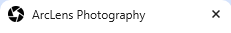

# ArcLens Photography

ArcLens Photography is a website dedicated to the the provision of top class, award winning architectural photography in the greater Dublin area. Primarily it is targeted at potential and existing clients to provide them with information about the company and the services we provide. However, we welcome all visitors to the site from enthusiasts to professionals. 

Visitors to this website can view our previous works through our portfolio, learn more about the companys day to day activities in our news section and reach out to us with any potential queries through our contact form.

The site can be accessed by this link.

## User Stories for ArcLens Photography

### 1. Visitor/ Potential Client

- As a visitor, I want to be able to navigate through the website easily to view the different portfolio projects completed by the company.
- As a visitor, I want to see high quality, high resolution imagery for each project.
- As a visitor, I want to be able to learn about the company and the variety of services they offer as well as being introduced to the photographer/s.
- As a visitor, I want to have the facility of a contact form so that I can reach out to the company with inquiries or project requests.
- As a visitor, I want to see a testimonials section from previous clients, this will allow me to gain confidence in the work and reliability of the company.

### 2. Returning Client

- As a returning client, I want to see a dedicated portfolio section for my project, this will allow me to share the work with others.
- As a returning client, I want to see a news/ blog section to keep up with the companies activities and projects.
- As a returning client, I want to see a private client portal in order for me to download high resolution versions of my commissioned images. (Future Feature)

### 3. Frequent Visitors

- As a frequent visitor, I want to see new updates to protfolios to show that the company is active.
- As a frequent visitor, I want to be informed of new features and services that are being offered by the company. 

### 4. Administrator (Photgrapher/Site Owner)

- As an administrator, I want to be able to update the news section, so I can share new information and announcements with my clients and general audience.
- As an administrator, I want to manage and respond to inquiries through the contact form, so I can communicate effectively and efficiently with potential clients.
- As an administrator, I want to update testimonials and add new client review, so I can keep the feedback on my work current and relevant. 

## UX Design

Design was based on a 'Bauhaus' colour scheme and design ethos. Bauhaus is a 20th century German design school of thought that follows the principal tenant of "form follows function and less is more". This style is characterised by a purposeful lack of ornamentation and a focus on clean lines to return forms to their essential elements. The style often includes the use of geometric shapes such as squares, triangles and circles.

In my design, I have opted for a clean minimalistic style of interface which follows the bauhaus principles and colour palette. This will aid in the accsessiblity and usability of the site.

### Colour Scheme

The colour scheme was inspired by some of the main tones found in Bauhaus design.

The aim of the colour scheme was to be light and inviting while matching in with the Bauhaus colour palatte. I opted for warm tan colours and then plain and simple black and white to make images and text stand out.

- '#d6c2af' was used as the primary background for headers, footers and navbar. It was also used as the primary colour for buttons.
- '#c7a381' was used as the secondary colour and was utilised as a border colour for buttons. I was also the background colour for hover effects on buttons. 
- '#000000' was used as the primary colour for all text.
- '#ccc'    was used as the secondary colour for text and appeared as the placeholder text in the contact form. 
- '#ffffff' was used as the primary background for the body of each page. 
- '#f4c150' was used as the colour for the star rating in testimonials.

I used the site [colorkit.io](https://colorkit.co/palette/d6c2af-c7a381-ffffff-ccc-000000-f4c150/) to create my colour palette.

### Typography

I chose [Montserrat](https://fonts.google.com/specimen/Montserrat) as my primary font in this project for its clean lines and adherence to Bauhaus design asthetics. 

As a contrast, [Lato](https://fonts.google.com/specimen/Lato) was choosen for the secondary font and used in testimonials and the contact form.

Sans-serif and cursive were used as fallback fonts. 

[Font Awesome](https://fontawesome.com) icons were used for all social media links in the burger menu and header. 

[favicon generator](https://favicon.io/favicon-converter/) was used to create a tab icon.

## Wireframes

### Home Page

| Size | Screenshot |
| --- | --- |
| Mobile |  |
| Tablet |  |
| Desktop |  |

### Portfolio Page

| Size | Screenshot |
| --- | --- |
| Mobile |  |
| Tablet |  |
| Desktop |  |

### Contact Page

| Size | Screenshot |
| --- | --- |
| Mobile |  |
| Tablet |  |
| Desktop |  |

## Features

### Existing Features

**Header & Navigation**

- Header with logo and navigation page allows for easy access to all available pages. I also made the choice to include the social media icons in the header beneath the nav bar for both style and functionality. My reasoning: people do not always scroll to the botton of the page.

   

- It is responsive depending on screen size. When it drops down beyond 1024px, all nav items and social media links are place in a burger menu.

 

    

 **Portfolio Navigation** 

 - The choice was made to include the portfolio navigation on both the home and portfolio pages. This design choice was made to improve user interaction. Users have the facility to access the websites portfolio on the home page without to many clicks. The navigation is fully adaptable for all screen sizes and goes from fixed text to appearing text on larger screens when the mouse is hovered over it. 

 

 

 **Contact Us Button**

 - This feature is included on every page outside of the contact page to give users the opportunity to access the contact form from anywhere on the website. This improves the user experience as it makes the website extremely accessible and encourages potential clients to reach out which is the overarching aim of the website as a whole. 

 

**Contact Us Form**

- The contact form allows users to reach out and request a quotation or call back as well as any other queries. The form requires all field to be filled to successfully send. 

**Contact Us Success Message**

- This message triggers once the send button has been triggered on the contact form. This provides the user with some feedback that thier query has been sent to the recipient successfully. 

**Favicon in Page Tab**

- The camera lens diapraghm makes the tab easily identifiable as a photography related website and therefore easier for the user to find.

**Footer**

- The footer is purposefully plain in this specific project as a personal choice of the designer. I often find users do not scroll to the bottom of the page and therefore the footer contents can often be lost. 

### Future Features

**About Section**

- Moving forward with this project, I would like to add functionality to the about section in order to provide a place for the user to learn more about the company and the people that work there. 

**News Section**

- The addition of a news section would allow users to stay up to date with company activities and projects in the form of regular news bulletins. 

## Tools and Technologies

The following are a list of tools and technologies used in the creation of this project:

-HTML was used to create the site content
-CSS was used to style the site content
-CSS Root Variables were used to allow for reusable styles throughout the project.
-CSS Flexbox was used to create a more responsive and appealing layout.
-Git Commands were used to ensure version control and the saving and proper storing of files to GitHub.
-Gitpod used as a cloud based integrated development environment for the creatiion of files and file structures.
-GitHub Pages were used for the deployment and hosting of the site.
-Fontawesome used to source icons for social media links. 
-Favicon.io was used to convert the icon I wished to use for the site browser tab. 
-TinyPNG was used to reduce image sizes. 

## Testing

For the testing outcomes of this site please refer to the [TESTING.md](TESTING.md) file.

## Deployment

The site was deployed to GitHub Pages. The steps to deploy are as follows:
- In the [GitHub repository](https://github.com/IanOC1994/arclens-photography), navigate to the Settings tab 
- From the source section drop-down menu, select the **Main** Branch, then click "Save".
- The page will be automatically refreshed with a detailed ribbon display to indicate the successful deployment.

The live link can be found [here](https://ianoc1994.github.io/arclens-photography/)

### Local Deployment

This project can be cloned or forked in order to make a local copy on your own system.

#### Cloning

You can clone the repository by following these steps:

1. Go to the [GitHub repository](https://github.com/IanOC1994/arclens-photography) 
2. Locate the Code button above the list of files and click it 
3. Select if you prefer to clone using HTTPS, SSH, or GitHub CLI and click the copy button to copy the URL to your clipboard
4. Open Git Bash or Terminal
5. Change the current working directory to the one where you want the cloned directory
6. In your IDE Terminal, type the following command to clone my repository:
	- `git clone https://github.com/IanOC1994/arclens-photography.git`
7. Press Enter to create your local clone.

Alternatively, if using Gitpod, you can click below to create your own workspace using this repository.

Please note that in order to directly open the project in Gitpod, you need to have the browser extension installed.
A tutorial on how to do that can be found [here](https://www.gitpod.io/docs/configure/user-settings/browser-extension).

#### Forking

By forking the GitHub Repository, we make a copy of the original repository on our GitHub account to view and/or make changes without affecting the original owner's repository.
You can fork this repository by using the following steps:

1. Log in to GitHub and locate the [GitHub Repository](https://github.com/IanOC1994/arclens-photography)
2. At the top of the Repository (not top of page) just above the "Settings" Button on the menu, locate the "Fork" Button.
3. Once clicked, you should now have a copy of the original repository in your own GitHub account!

## Local VS Deployment

There are no difference between the deployed version and the development version.