## Code Validation

### HTML

I have used the recommended [HTML W3C Validator](https://validator.w3.org) to validate all of my HTML files.

#### Initial

---

| Page | Screenshot | Notes |
| --- | --- | --- |
| Home |  | use of 'li' element inside a 'div'. Fix: replace div with menu element|
| Home |  | Button element must not be a descendant of 'a' element |
| Home |  | Section lacks header h2-h6 warning |
| Portfolio |  | use of 'li' element inside a 'div'. Fix: replace div with menu element|
| Contact Success |  | Section lacks header h2-h6 warning |

- I carried the majority of error fixes that arose out of html validation for the home page across all pages. 

#### Final State 

| Page | Screenshot | Notes |
| --- | --- | --- |
| Home |  | Pass: No Errors |
| Portfolio |  | Pass: No Errors |
| Contact |  | Pass: No Errors |
| Contact Success |  | Pass: No Errors |

### CSS

I have used the recommended [CSS Jigsaw Validator](https://jigsaw.w3.org/css-validator/) to validate the CSS file for this project.

| Page | Screenshot | Notes |
| --- | --- | --- |
| style.css | 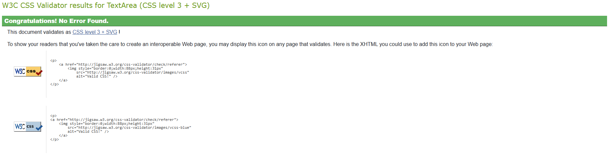 | Pass: No Errors |

## Responsiveness

I've tested my deployed project on multiple devices to check for responsiveness issues.

| Device | Screenshot | Notes |
| --- | --- | --- |
| Mobile (DevTools) |  | Works correctly |
| Tablet (DevTools) | 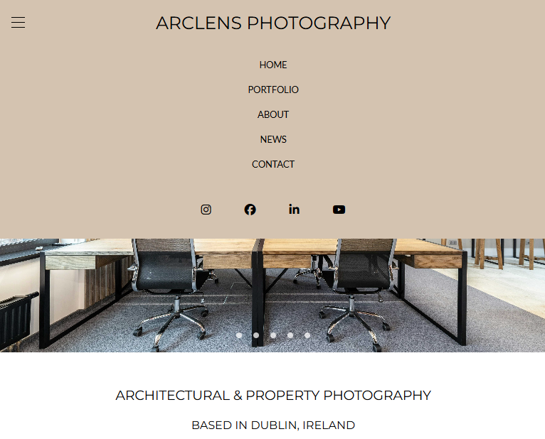 | Works correctly  |
| Desktop (DevTools) | 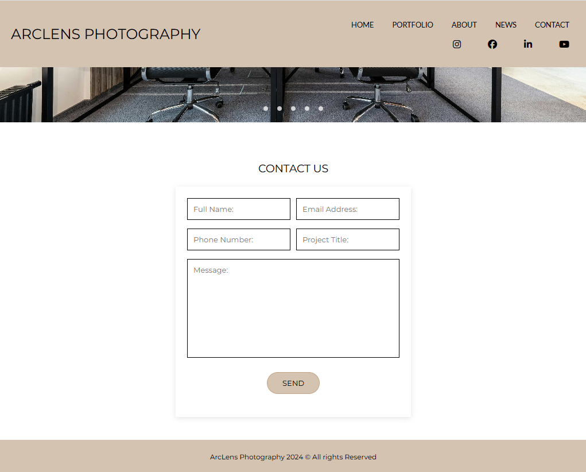 | Works correctly  |
| Desktop large (DevTools) | 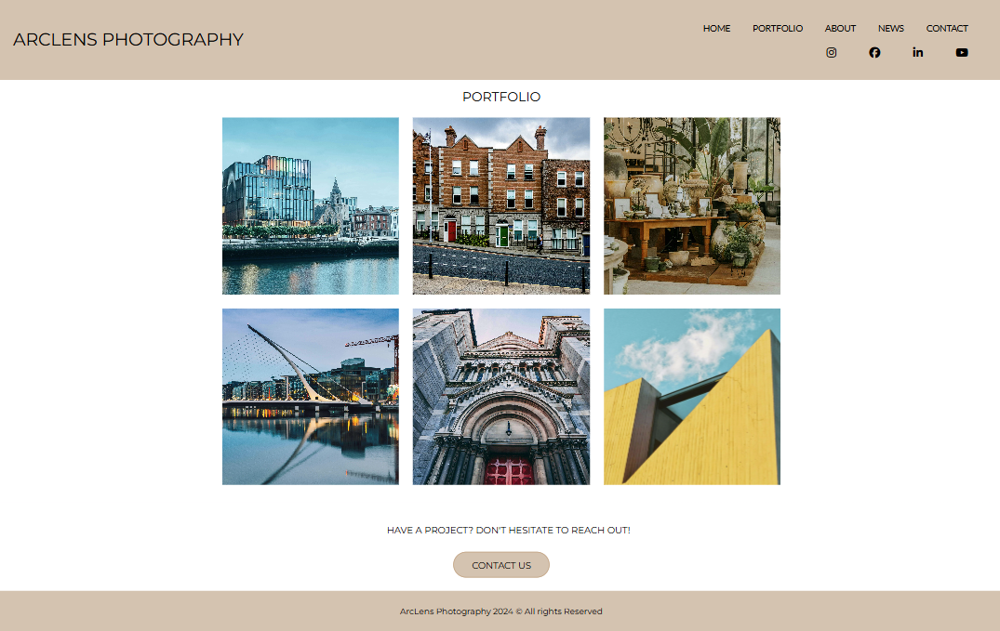 | Works correctly  |

## Lighthouse Audit

I've tested my deployed project using the Lighthouse Audit tool to check for any major issues.

| Page | Size | Screenshot | Notes |
| --- | --- | --- | --- |
| Home | Mobile | 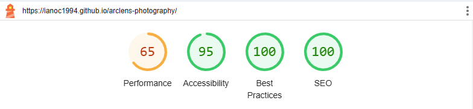 | Some warnings,  Slower response time due to large images |
| Home | Desktop | 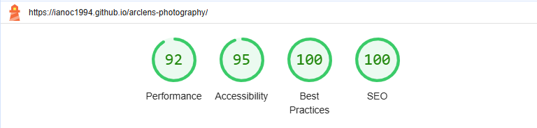 | Some warnings,  Slower response time due to large images |
| Portfolio | Mobile | 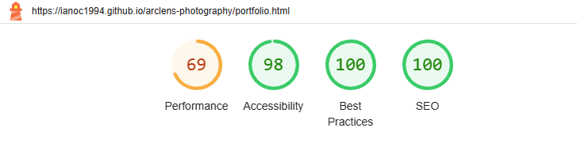 | Some warnings,  Slower response time due to large images |
| Portfolio | Desktop | 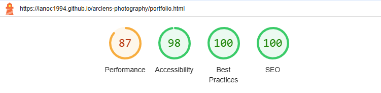 | Some warnings,  Slower response time due to large images |
| Contact | Mobile | 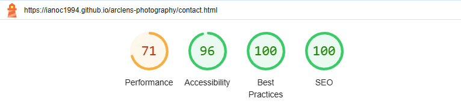 | Some warnings,  Slower response time due to large images |
| Contact | Desktop | 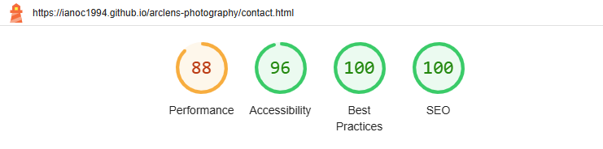 | Some warnings,  Slower response time due to large images |
| Contact Success | Mobile |  | Some warnings,  Slower response time due to large images |
| Contact Success | Desktop | 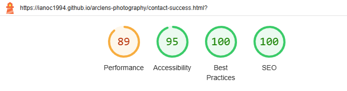 | Some warnings,  Slower response time due to large images |

- Some of the lighthouse tests where slower due to the size of images in the carousel. I tested reducing the image size however, as you can see this has caused a degredation of quality.
