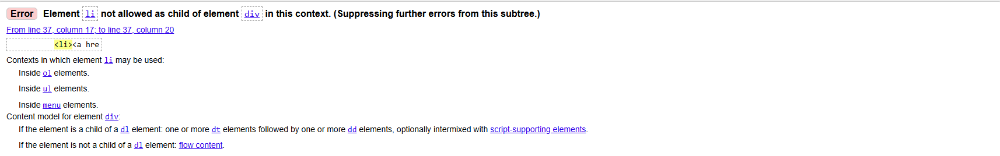
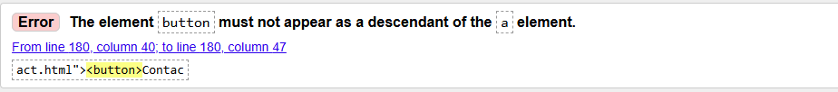
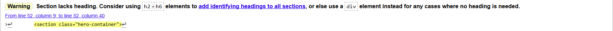
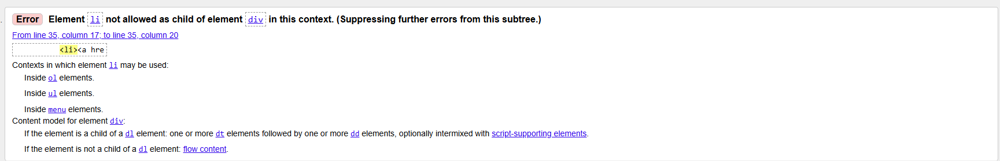
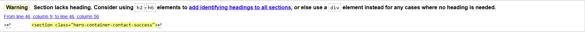
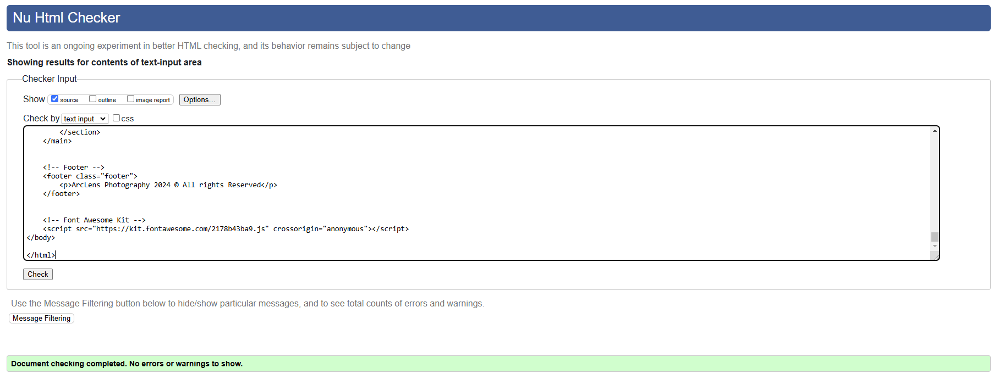
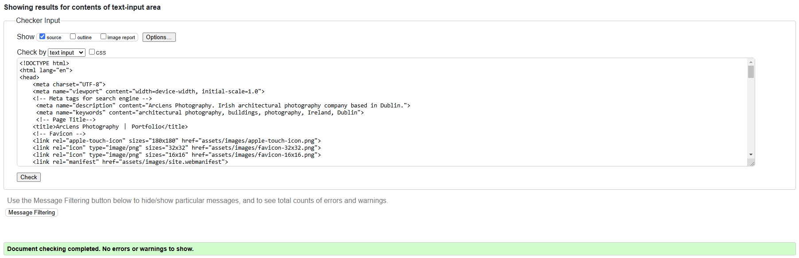
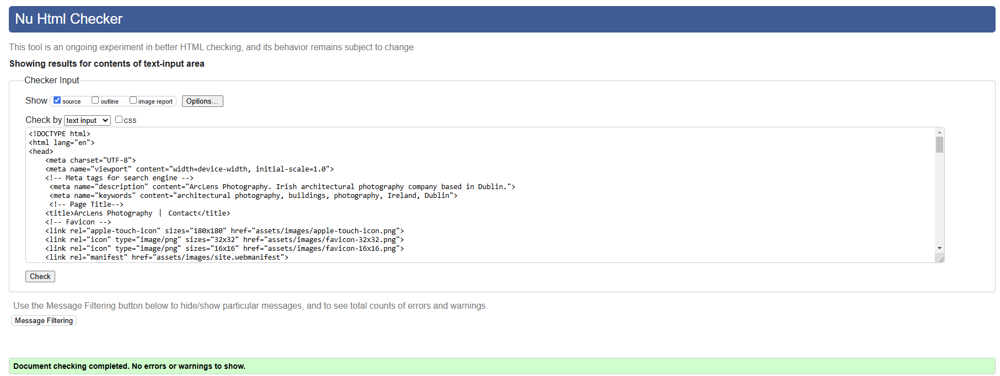
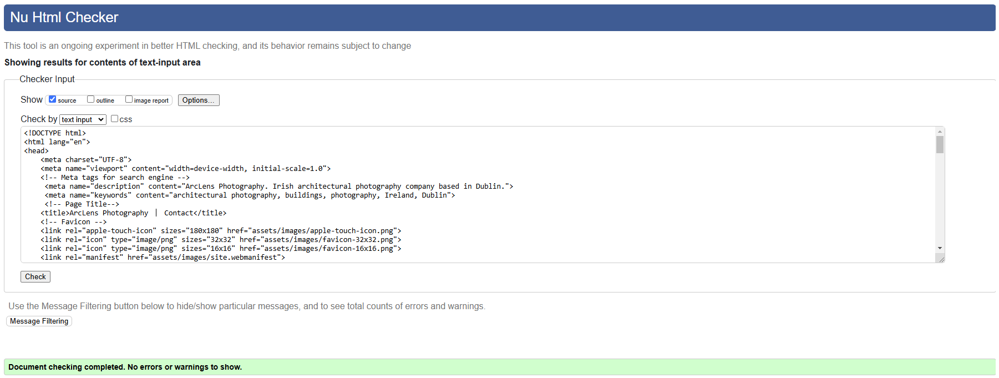

## Code Validation

### HTML

I have used the recommended [HTML W3C Validator](https://validator.w3.org) to validate all of my HTML files.

#### Initial

---

| Page | Screenshot | Notes |
| --- | --- | --- |
| Home |  | use of 'li' element inside a 'div'. Fix: replace div with menu element|
| Home |  | Button element must not be a descendant of 'a' element |
| Home |  | Section lacks header h2-h6 warning |
| Portfolio |  | use of 'li' element inside a 'div'. Fix: replace div with menu element|
| Contact Success |  | Section lacks header h2-h6 warning |

- I carried the majority of error fixes that arose out of html validation for the home page across all pages. 

#### Final State 

| Page | Screenshot | Notes |
| --- | --- | --- |
| Home |  | Pass: No Errors |
| Portfolio |  | Pass: No Errors |
| Contact |  | Pass: No Errors |
| Contact Success |  | Pass: No Errors |